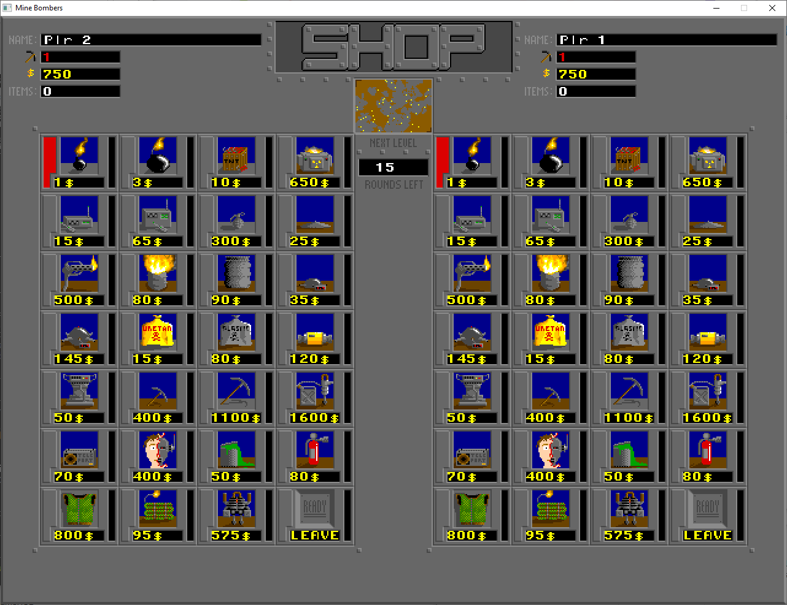

# Mine Bombers port

A faithful, open-source recreation of **Mine Bombers 3.11** (1995–2001) by
**Skitso Productions** — the DOS arcade classic for 1–4 players: dig through
the mine, collect treasures, and blow your friends up with an arsenal of 27
weapons.



This project is not affiliated with or endorsed by the original authors. This
repository contains **only the port's own source code and documentation** —
no original game files, assets, or code derived from the original executable.
To play, you supply your own copy of the original game data: the registered
version of Mine Bombers was released as **freeware** by Skitso Productions on
31 December 2001 and is available from established archives (see below).

## Requirements

- Windows (primary target). Built with MinGW-w64 GCC.
- CMake 3.20+ and git — dependencies (raylib, libxmp, Unity) are fetched
  automatically at configure time.
- The original Mine Bombers 3.11 game data (see next section).

## Build

```
cmake -S . -B build -G "MinGW Makefiles"
cmake --build build
```

This produces `build/minebombers.exe`. It builds fine without the game data;
you only need the data to actually run the game.

## Get the game data

The port reads the original, unmodified game files from an `assets/` folder
next to the executable.

1. Download the official Mine Bombers 3.11 freeware release, for example
   from the Internet Archive:
   <https://archive.org/download/mnb311fw/mnb311fw.zip>
   (item page: <https://archive.org/details/mnb311fw>, ~1 MB).
2. Create a folder named `assets` next to `minebombers.exe` — for a source
   build that is `build/assets/`.
3. Extract the **entire contents** of the zip **directly into `assets/`**.
   The zip is flat (no subfolders), so every file — `MB.EXE`, `SIKA.SPY`,
   `LEVEL0.MNL`, `HUIPPE.S3M`, … — must end up directly inside `assets/`,
   not in a subfolder like `assets/mnb311fw/`.
4. Run `minebombers.exe` from its own folder (double-clicking it in
   Explorer is fine). The game looks for `assets/` relative to the folder
   it is started from.

Steps 1–3 in PowerShell, from the repository root:

```powershell
Invoke-WebRequest https://archive.org/download/mnb311fw/mnb311fw.zip -OutFile mnb311fw.zip
Expand-Archive mnb311fw.zip -DestinationPath build\assets
```

Notes:

- On the first run the log shows `FILEIO: [assets/keybinds.dat] Failed to
  open file` — harmless. The file is created when you save key bindings in
  the options menu.
- `minebombers.log` is written next to the exe on every run; check it first
  if something fails to load.
- Like the DOS original, the game stores its data (player roster, hall of
  fame, options) in the original binary formats inside `assets/`, so files
  remain compatible with the original game.

## Tests

```
ctest --test-dir build --output-on-failure
```

Many tests load original game files and expect an `assets/` folder inside
`build/tests/` as well:

```powershell
Expand-Archive mnb311fw.zip -DestinationPath build\tests\assets
```

## About the original game

This project is a source port / faithful recreation of **Mine Bombers 3.11**
(1995–2001) by **Skitso Productions**. All credit for the game's design,
graphics, sound, and music belongs to the original authors.

## Developing

New to the codebase? Start with the
**[Architecture overview](docs/architecture.md)** — a short orientation to
the code layout, game state machine, and porting philosophy. Deeper
reverse-engineering reference documentation (file formats, game mechanics,
rendering pipeline, input, AI) lives under `docs/reference/`.

## License

PolyForm Noncommercial 1.0.0 — see `LICENSE.md`. The license covers only this
port's source code; it grants no rights of any kind to Mine Bombers itself or
its assets, which remain the property of Skitso Productions.
